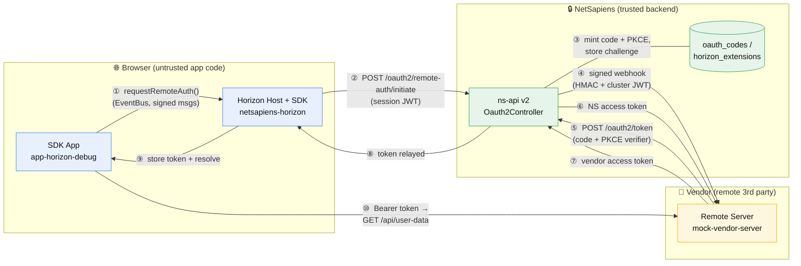
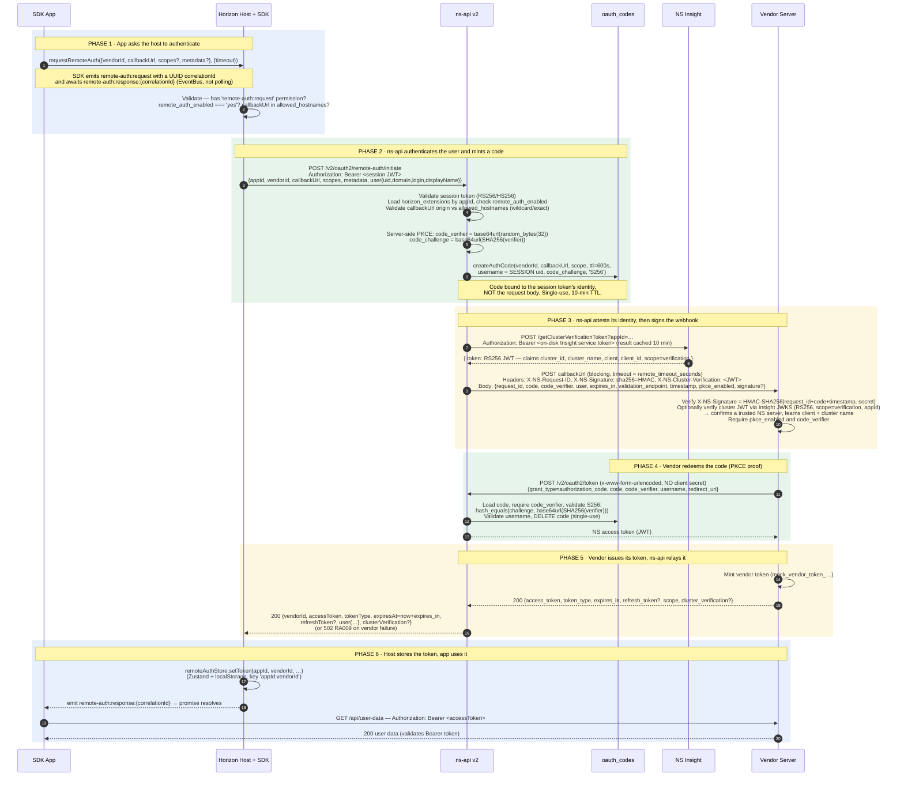

# Horizon Remote Authentication — End-to-End Flow

This document describes how authentication works across the **Horizon** platform when a
remote SDK app requests an access token from a third‑party ("vendor") service. It is a
descriptive reference of the system as it exists today, drawn from the source of all four
projects involved.

> A print-friendly, self-contained version of this document lives next to it as
> [`auth-flow.html`](./auth-flow.html) — open it in a browser and **Print → Save as PDF**.

---

## 1. Overview

The flow chains four actors. A remote SDK app (running inside the Horizon host in the
browser) asks the host to authenticate it with a vendor. The host calls the NetSapiens
API (**ns‑api v2**), which mints a short-lived authorization code (with server-side PKCE),
then signs and POSTs a webhook to the vendor's callback URL. The vendor validates the
webhook, redeems the code back against ns‑api, issues its own access token, and returns it.
ns‑api relays that token to the host, which stores it and resolves the app's promise.



**Trust boundaries.** Everything in the blue zone is untrusted browser code — the SDK app
is third-party and the host treats it accordingly (signed messages, permission gates, rate
limits). The green zone is the trusted NetSapiens backend that owns identity, codes, and
signing keys. The yellow zone is an external vendor reachable only at an allow-listed
callback URL.

---

## 2. Actors & artifacts

| Actor | Repo / key files | Holds |
|---|---|---|
| **SDK App** | `app-horizon-debug` — `src/pages/RemoteAuthDemo.tsx`, `horizon-app.json` | The app manifest (`permissions: ["remote-auth:request"]`); the vendor access token after success (via the host store) |
| **Horizon Host + SDK** | `netsapiens-horizon` — `src/components/sdk/HorizonAppsLoader.tsx`, `src/lib/sdk/remoteAuth.ts`, `src/store/useRemoteAuthStore.ts`, `src/sdk/security/*`, `src/sdk/loader/ModuleLoader.ts` | The user's session JWT; the per-app HMAC signing key; the `localStorage` token store |
| **ns‑api v2** | `netsapiens-api-v2` — `src/Controller/Oauth2Controller.php`, `src/Model/Table/{Oauthcodes,OauthJwts,HorizonExtensions}Table.php`, `db/api_db_v46.sql` | Authorization codes + PKCE challenges (`oauth_codes`); the extension registry incl. `remote_callback_secret` (`horizon_extensions`); JWT signing keys (RS256/HS256) |
| **Vendor (remote) server** | `app-horizon-debug/mock-vendor-server/index.js` | The `remote_callback_secret` (shared with ns‑api for HMAC); its own access tokens; JWKS trust for the Insight cluster JWT |

---

## 3. Main remote-auth sequence



The key subtlety: `/oauth2/remote-auth/initiate` is **synchronous**. ns‑api blocks while it
POSTs the webhook to the vendor; the vendor, *within that webhook request*, redeems the
code at `/oauth2/token` and returns its own token; ns‑api then relays that token in the
`initiate` HTTP response (`Oauth2Controller.php` L6408–6447).

---

## 4. Security mechanisms

Each mechanism below lists **what it is**, **where it lives in code**, the **algorithm /
inputs**, and **what it protects**.

### 4.1 Session authentication (initiate call)
- **Where:** `Oauth2Controller::remoteAuth()` (`netsapiens-api-v2/src/Controller/Oauth2Controller.php` ~L6200–6217).
- **How:** The `initiate` request must carry `Authorization: Bearer <token>` — a NetSapiens
  JWT or legacy access token. Validated before anything else (errors `RA001`/`RA002`).
- **JWT details:** Issued by `OauthJwtsTable::generateToken()`. Signed **RS256** (private key
  at `NsJwtPrivateKeyPath`, verified via JWKS `/.well-known/jwks.json`) or **HS256** (symmetric
  key derived from per-user + cluster salt). Claims include `sub` (user@domain), `domain`,
  `user_scope`, `exp`, `iat`, `jti`, `aud='ns'`.
- **Protects:** Ensures only an authenticated NetSapiens user can initiate remote auth, and
  pins the resulting code to *that* user's identity.

### 4.2 App permissions & capability gates
- **Where:** `HorizonAppsLoader.tsx` (permission check before initiate) and
  `src/sdk/security/PermissionManager.ts`.
- **How:** The app's manifest must declare `remote-auth:request`. `PermissionManager` also
  gates route/extension registration per app, and a platform-global toggle
  (`permissionEnabled`) can disable a capability for every app at once.
- **Protects:** A remote app can only invoke surfaces it was granted; one app cannot act as
  another.

### 4.3 Callback hostname allow-listing
- **Where:** Host-side pre-check in `HorizonAppsLoader.tsx`; authoritative check in
  `Oauth2Controller::remoteAuth()` (~L6268–6317).
- **How:** `callbackUrl`'s origin is matched against the extension's `allowed_hostnames`
  (comma-separated or JSON array). Supports exact match and wildcard (`*.example.com` with a
  dot-boundary so `evil-example.com` is rejected). Failures → `RA007` / `RA007B`.
- **Protects:** ns‑api will only send the signed webhook (containing the code + PKCE
  verifier) to pre-approved destinations.

### 4.4 Authorization code
- **Where:** `OauthcodesTable::createAuthCode()`; stored in the `oauth_codes` table; consumed
  in `_grantByAuthCode` (~L1684–1719).
- **How:** Random code persisted with `client_id`=vendorId, `redirect_uri`=callbackUrl,
  `scope`, `expires`=now+**600s**, and `username` bound to the **session token's** uid (the
  request body's `user.uid` is checked but not trusted). The code is **deleted after a
  successful exchange** — single use (RFC 6749 §4.1.2).
- **Protects:** Limits the validity window, binds the grant to the real user, and prevents
  replay.

### 4.5 Server-side PKCE (S256)
- **Where:** `_generateCodeVerifier` / `_generateCodeChallenge` (~L6329, L6662);
  `_validatePKCE` (~L6675).
- **How:** ns‑api generates **both** halves of the PKCE pair: `code_verifier` =
  base64url(`random_bytes(32)`) (256-bit), `code_challenge` = base64url(SHA256(verifier)).
  Only the **challenge** is stored (in `oauth_codes`); the **verifier** is shipped to the
  vendor inside the webhook. At token exchange the vendor returns the verifier, and ns‑api
  validates `hash_equals(challenge, base64url(SHA256(verifier)))`.
- **Note on placement:** This is a server-side variant of PKCE. Rather than the public client
  generating the verifier, ns‑api mints it and hands it to the vendor over the signed
  webhook; the vendor proves it received that exact webhook by echoing the verifier back.
- **Protects:** Ties the code redemption to the party that actually received the webhook; a
  stolen code alone (without the verifier) cannot be redeemed.

### 4.6 HMAC webhook signing
- **Where:** Sign side — `Oauth2Controller::remoteAuth()` (~L6400–6404) / `_sendWebhook`.
  Verify side — `mock-vendor-server/index.js` (~L291–320).
- **How:** When the extension has a `remote_callback_secret`, ns‑api computes
  `signature = HMAC-SHA256(request_id + code + timestamp, secret)` and sends it both in the
  body (`signature`) and as the header `X-NS-Signature: sha256=<hex>`. The vendor recomputes
  the same HMAC over `request_id + code + timestamp` and compares (constant-time); mismatch →
  HTTP 401.
- **Protects:** Authenticates the webhook as genuinely from NetSapiens and detects tampering.

### 4.7 RS256 cluster-verification JWT (proves the caller is a genuine NetSapiens server)

This is an optional *second* proof on the webhook, complementary to the HMAC. Where the HMAC
proves "whoever holds the shared secret sent this", the cluster-verification JWT proves "this is
a real NetSapiens cluster" and tells the vendor **which client and cluster** it is talking to —
without the vendor having to pre-share any secret.

**How ns‑api obtains the token (the Insight sub-flow).**
- Every NetSapiens server holds a short-lived **service token on disk** at
  `/etc/netsapiens/insight.d/token.jwt` (configurable via `NsInsightTokenPath`). This is the
  cluster's own machine identity to Insight, provisioned and rotated out of band — it is *not*
  the end-user's session token.
- When building the webhook, `_sendWebhook` calls `_getClusterVerificationToken($appId)`
  (`Oauth2Controller.php` L6462). On a cache miss (10-minute TTL, keyed per `appId`) it reads
  that on-disk service token and makes a server-to-server call:
  ```
  POST  https://insight.netsapiens.com/getClusterVerificationToken?appId=<appId>
  Authorization: Bearer <on-disk Insight service token>
  ```
  (TLS verified, 10s timeout, `NsInsightServer` overrides the host.) Insight authenticates the
  service token and returns `{ "token": "<RS256 JWT>" }`. ns‑api caches the JWT for 10 minutes
  (`cluster_verification_token:{appId}`) and attaches it as the
  **`X-NS-Cluster-Verification`** header (`Oauth2Controller.php` L6580–6582).

**What the JWT carries.** It is signed by Insight (RS256) and includes `cluster_id`,
`cluster_name`, `client`, `client_id`, `scope = 'verification'`, `iss`, `iat`, `exp`.

**What the vendor does (optional verification).** `mock-vendor-server/index.js` (~L159–288)
verifies it with `jwks-rsa` against the Insight JWKS endpoint
(`/.well-known/jwks.json`, `algorithms: ['RS256']`), checking `scope === 'verification'` and a
matching `appId`. On success the verified claims tell the vendor the request came from a
**trusted NetSapiens server** and reveal the **client name and cluster name**. Verification
failure is non-fatal in the mock (logs a warning; HMAC remains the primary gate).

**Why two layers.** The HMAC secret is shared per-extension and could be misconfigured or leaked;
the cluster JWT is asymmetric — the vendor needs no shared secret, only Insight's public keys —
and is centrally attestable, so a vendor can trust "this is NetSapiens, cluster X, client Y"
without any prior key exchange with the cluster.

### 4.8 Vendor bearer token
- **Where:** `mock-vendor-server/index.js` `/api/user-data` (~L508–548).
- **How:** The vendor issues `mock_vendor_token_<random>` on success. Protected vendor
  endpoints require `Authorization: Bearer <token>`; the server checks the `Bearer ` prefix
  and the token shape, returning 401 otherwise.
- **Protects:** Gates the vendor's own resources behind the token it issued.

### 4.9 Host ↔ app message signing
- **Where:** `netsapiens-horizon/src/sdk/security/MessageSigner.ts`; consumed e.g. in
  `src/sdk/routing/DynamicRouteManager.ts` (`extractPayload`, `_meta`).
- **How:** Messages between host and remote app can be wrapped as a `SignedMessage` whose
  `_meta` carries `{appId, nonce, timestamp, signature}`. Signature =
  HMAC-SHA256 (`crypto.subtle`) over `appId|type|payload|nonce|timestamp`. Verification checks
  the HMAC, rejects replayed nonces (tracked, cleared ~10 min), and enforces timestamp
  freshness (~5 min, ±1 min skew).
- **Protects:** Integrity/authenticity of the postMessage-style channel between the trusted
  host and untrusted app code.

### 4.10 Module-load & API-proxy controls
- **Where:** `src/sdk/loader/ModuleLoader.ts`, `src/sdk/security/IntegrityValidator.ts`,
  `src/sdk/security/HorizonApiProxy.ts`.
- **How:**
  - **Approved domains:** remote-entry scripts load only from an allow-list (wildcards with
    dot-boundary).
  - **SRI integrity:** optional `sha256/384/512` hash validated via `crypto.subtle.digest`
    before a script is trusted.
  - **CSP nonce:** injected onto the script tag from config or a `meta[name=csp-nonce]`.
  - **Rate limiting:** module loads capped at **10/min per URL**; the per-app API proxy caps
    requests at **100/min per app** and writes an audit log entry (appId, path, status,
    duration) for every call.
- **Protects:** Supply-chain integrity of remote bundles and abuse limiting of the API
  surface exposed to apps.

---

## 5. Data shapes reference

**`POST /v2/oauth2/remote-auth/initiate` — request**
```json
{
  "appId": "demo-app-with-auth",
  "vendorId": "demo-app-with-auth",
  "callbackUrl": "https://sdk.nseng.dev/mock-server/oauth/callback",
  "scopes": ["read", "write"],
  "metadata": { "timestamp": "2026-06-14T12:00:00.000Z" },
  "user": { "uid": "1000", "domain": "example.com", "login": "1000@example.com", "displayName": "Jane" }
}
```

**`initiate` — response (200)**
```json
{
  "vendorId": "demo-app-with-auth",
  "accessToken": "mock_vendor_token_ab12…",
  "tokenType": "Bearer",
  "expiresAt": 1771000000,
  "refreshToken": "mock_refresh_…",
  "user": { "uid": "1000", "login": "1000@example.com", "domain": "example.com", "scope": "…", "displayName": "Jane" },
  "clusterVerification": { "verified": true, "cluster_id": 23573, "app_id": "demo-app-with-auth" }
}
```

**Webhook to vendor — headers + body**
```
POST <callbackUrl>
Content-Type: application/json
X-NS-Request-ID: remauth_xxx
X-NS-Signature: sha256=<hex hmac of request_id+code+timestamp>
X-NS-Cluster-Verification: <RS256 JWT>        (optional)
```
```json
{
  "request_id": "remauth_xxx",
  "code": "<authorization code>",
  "code_verifier": "<base64url, 43 chars>",
  "user": { "uid": "1000@example.com", "domain": "example.com", "displayName": "Jane" },
  "expires_in": 600,
  "validation_endpoint": "https://core.netsapiens.com/ns-api/v2/oauth2/token",
  "timestamp": 1770999400,
  "pkce_enabled": true,
  "signature": "<hex hmac>"
}
```

**`POST /v2/oauth2/token` — request (vendor → ns‑api, `x-www-form-urlencoded`, no client secret)**
```
grant_type=authorization_code
code=<authorization code>
code_verifier=<same verifier from webhook>
username=1000@example.com
redirect_uri=https://sdk.nseng.dev/mock-server/oauth/callback
```

**Vendor webhook response (vendor → ns‑api, 200)**
```json
{
  "access_token": "mock_vendor_token_ab12…",
  "token_type": "Bearer",
  "expires_in": 7200,
  "refresh_token": "mock_refresh_…",
  "scope": "read write",
  "cluster_verification": { "verified": true, "cluster_id": 23573, "app_id": "demo-app-with-auth" }
}
```

**`horizon_extensions` — remote-auth config fields**

| Field | Purpose |
|---|---|
| `id` | Kebab-case extension id (= `kebab(webpack_module)`), e.g. `demo-app-with-auth` |
| `webpack_module` | Module Federation container name, e.g. `demoAppWithAuth` |
| `remote_entry_url` | URL of the remote bundle's `remoteEntry.js` |
| `enabled` | Master on/off (`yes`/`no`) |
| `remote_auth_enabled` | Enables the remote-auth flow (`yes`/`no`) |
| `allowed_hostnames` | Comma-separated/JSON allow-list of callback origins |
| `remote_callback_secret` | Shared HMAC-SHA256 key for webhook signing |
| `remote_timeout_seconds` | Webhook timeout (default 30) |
| `integrity_hash` | Optional SRI hash for the remote bundle |

**`horizon-app.json` — app manifest**
```json
{
  "id": "demoAppWithAuth",
  "name": "Horizon Debug App",
  "version": "0.1.0",
  "permissions": ["remote-auth:request"]
}
```

---

## 6. Error codes (`remote-auth/initiate`)

| Code | HTTP | Meaning |
|---|---|---|
| `RA001` | 401 | Invalid JWT / token in `Authorization` header |
| `RA002` | 401 | Invalid or expired access token |
| `RA003` | 400 | Missing `appId` |
| `RA003B` | 400 | Missing `vendorId` |
| `RA004` | 400 | Missing `callbackUrl` |
| `RA005` | 400 | Missing `user.uid` |
| `RA006` | 404 | App not found / remote auth disabled |
| `RA006B` | 500 | Invalid `allowed_hostnames` configuration |
| `RA007` | 400 | Invalid callback URL format |
| `RA007B` | 403 | Callback URL not in `allowed_hostnames` |
| `RA009` | 502 | Vendor webhook failed |

---

## 7. Try it

The hands-on setup (registering the extension, the SQL to enable remote auth + set
`allowed_hostnames` / `remote_callback_secret`, running the mock vendor server, and the
click-through) is documented in:

- [`PKCE_TESTING.md`](./PKCE_TESTING.md) — step-by-step PKCE test walkthrough.
- [`mock-vendor-server/README.md`](./mock-vendor-server/README.md) — the vendor server's
  endpoints and configuration.
